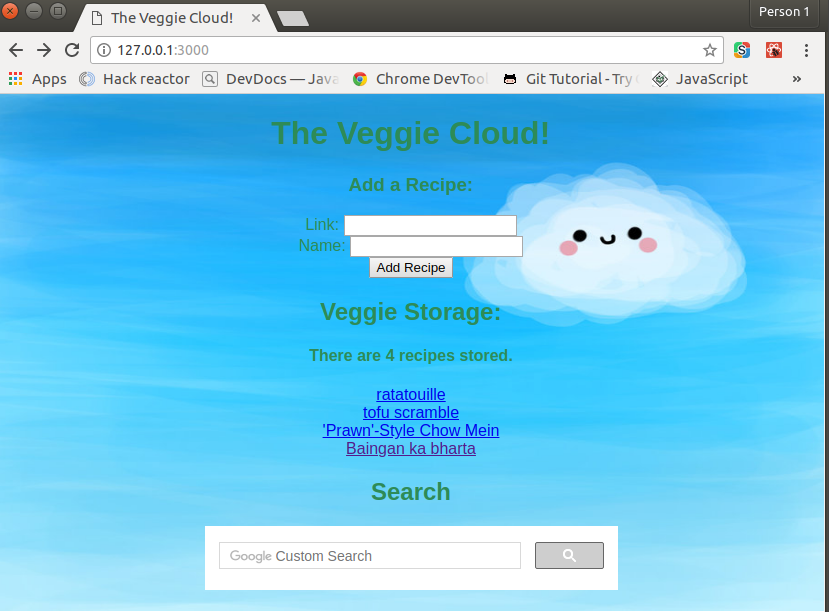

# The Veggie Cloud!

## MVP:The Veggie Cloud! ##

## Description: ##
  > The Veggie Cloud!: The Veggie Cloud! is an app that can store recipes
  > that you love or want to try later, also includes a Custom search
  > engine (powered by google) in order to view more vegan o vegetarian
  > versions of your favorites.

## General Information: ##
  1. Reactjs: Front-end
  2. Express.js: Back-end
  3. MySQL Database
  4. Search: Google Custom Search engine

## Problem ##
  > No more losing your favorite recipes, store them in The Veggie Cloud
  > "FOREVER!!"; plus have custom search and find all the veggie friendly
  > recipes your heart and tummy desires!

## How to Get Started ##
1. Perform a Git Fork on the repository
2. Perform a Git Clone from your Github Repo to create a local clone of the project
3. Install nodemon by typing 'npm install -g nodemon'
4. Install all the projects dependencies by performing an npm install by typing 'npm install'
6. In a terminal window, type 'npm run react-dev'. This will start webpack for the jsx files
7. In a new terminal window, type 'npm run start'. This starts the express web server
8. In a browser window enter http://localhost:3000 to view the main page of the site
